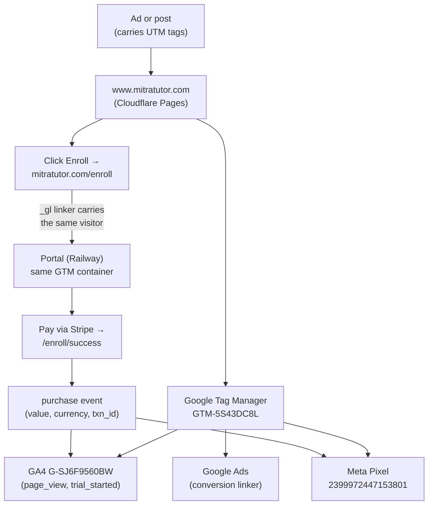

# Mitra Attribution, Operator's Guide

*Everything you need to set up tracking links yourself, hand the job to someone who has never done it, and understand why each piece exists. If you only need to give a partner a link, send them the [Partner Link Guide](partner-link-guide.md) instead, this document is the full picture.*

Last verified live: 2026-06-11.

---

## 1. The goal in one sentence

**Every visit to the Mitra site should be traceable to where it came from (source), which specific ad or post produced it, and whether it led to a trial or a paid subscription, including the revenue.**

If that chain holds, you can answer the only questions that matter for spending money on marketing:
1. How many people came?
2. From which source?
3. From which specific ad or post?
4. Which page did they land on?
5. Did they start a trial / pay?
6. **Which source and which ad actually produce paying customers?**

Tracking is "working" when question 6 has a real answer. Everything below exists to make that true.

---

## 2. How the system works (follow one click)



The pieces, and what each is for:

| Piece | Job | ID / location |
|---|---|---|
| **UTM tags** | Tell GA4 the source / ad / post. Without them, traffic is "Direct/Unassigned." | On the link |
| **GTM** | The dispatcher. One container forwards events to GA4, Meta, Google Ads. | `GTM-5S43DC8L` (on both the website and the portal) |
| **GA4** | Your analytics. Counts visits + conversions by source. | `G-SJ6F9560BW` |
| **Cross-domain linker (`_gl`)** | Carries the same visitor from `www.mitratutor.com` to `mitratutor.com` so the enrollment still ties back to the ad. | Automatic, verified working |
| **Meta Pixel** | Feeds Facebook/Instagram ad attribution + ROAS in Meta Ads Manager. | `2399972447153801` |
| **Google Ads linker** | Lets Google Ads bid on GA4 conversions. | `572-702-7541` |
| **CSP** (portal only) | Security allow-list. If you add a NEW tracker, its domain must be added here or the browser silently blocks it. | `tutor` repo `portal/app.py` |

**Two truths to hold onto:**
- The **website** (`www`, Cloudflare) has no CSP and is the easy surface.
- The **portal** (`mitratutor.com`, Railway) has a CSP. Adding a new tracker there without updating the CSP = silent failure.

---

## 3. The UTM taxonomy (the naming rules)

Every tracking link is the page URL + four tags:

| Tag | Means | Allowed values |
|---|---|---|
| `utm_source` | where/who the click came from | `instagram`, `facebook`, `naver`, `kakao`, `youtube`, `email`, or a **partner id** like `blog-supermom`, `hagwon-brightline` |
| `utm_medium` | the bucket | `cpc` = paid ads · `social` = organic posts · `referral` = partner sites/blogs · `email` = newsletters · `messenger` = KakaoTalk/Telegram/WhatsApp |
| `utm_campaign` | the initiative | `2026-adhd-launch`, `partner-{name}`, or `pain-{slug}` for the pain landing pages |
| `utm_content` | **which exact ad or post** ← this answers question 3 | `reel-mar12`, `blogpost-homework`, `carousel-a` |

**Formatting rules (non-negotiable, or the data fragments):**
- all lowercase
- spaces become hyphens (`march-adhd-review`, never `March ADHD Review`)
- no personal info, no emojis, no `?` or `&` inside a value
- `cpc` for **paid**, `social` for **organic**, this is what separates ad spend from free posts in GA4 ("Paid Social" vs "Organic Social")

---

## 4. Build a tracking link in 30 seconds

**Recipe:** take the landing page, add the four tags.

```
https://www.mitratutor.com/en/free-trial?utm_source=instagram&utm_medium=social&utm_campaign=2026-adhd-launch&utm_content=reel-mar12
```

Korean visitors → use `/ko/` instead of `/en/`.

**Helper script (already in the repo):** `scripts/pain_utms.py` builds ready-to-paste links for the pain landing pages across every platform:
```
python scripts/pain_utms.py parent-stuck v2
python scripts/pain_utms.py --list
```
For non-pain pages, copy the recipe above and fill the four tags by hand, or use any UTM builder (e.g. Google's Campaign URL Builder) with the values from section 3.

---

## 5. Your own paid ads, set Meta dynamic params ONCE

Don't hand-tag every ad. In **Meta Ads Manager**, set the ad-level **URL parameters** once and every ad self-tags with its own name:

```
utm_source=facebook&utm_medium=cpc&utm_campaign={{campaign.name}}&utm_content={{ad.name}}
```

Set this at the account/campaign template level (Ads Manager → ad → "URL parameters" / "Build a URL parameter"). Use `instagram` as source for IG placements if you separate them. Now every ad reports its real name in `utm_content` with zero per-ad work. (Google Ads does the equivalent automatically via the GA4↔Ads link + auto-tagging, no UTMs needed there.)

**Organic posts and partners do NOT get this**, they need manual tags. That's what the [Partner Link Guide](partner-link-guide.md) is for.

---

## 6. Verify a link actually works (do this before spending money)

1. Open the link in an incognito window.
2. In **GA4 → Reports → Realtime**, watch "Event count by event name." You should see `page_view` and (if you click the CTA / complete the action) `trial_started` or `purchase`.
3. For the deepest check, GA4 → Admin → **DebugView** with the GA Debugger on shows every parameter, including `utm_source`, `value`, `currency`.
4. Confirm the source is attributed correctly: GA4 → Reports → Acquisition → **Traffic acquisition**, set the dimension to **Session source / medium**. Your test should appear under the source you tagged, not "Direct."

**Two gotchas that waste hours if you forget them:**
- **GA4 data filters take 24-36 hours to apply.** Realtime is instant; processed reports lag.
- **Meta Pixel has a domain allow-list.** Events return HTTP 200 but never count if the domain isn't in the Pixel's Traffic Permissions allow-list. Check that FIRST if Meta shows nothing.

---

## 7. The conversion events (what's actually tracked)

| GA4 event | Fires when | Carries | Key event? |
|---|---|---|---|
| `trial_started` | someone completes a free-trial signup | `platform` | yes (mark in GA4 once cataloged) |
| `purchase` | someone completes a paid Stripe enrollment | `value`, `currency`, `transaction_id` | yes (auto) |
| `enroll_click` | a CTA on the site is clicked | `cta_location` | optional |

`purchase` is the money event, it carries real revenue, so GA4 reports revenue and Google Ads can bid on value. `trial_started` is a free signup, so it has no value by design.

---

## 8. Don't pollute your own data (internal traffic)

Your own browsing would otherwise count as fake conversions (this already happened once, pre-2026-06-11 data is contaminated and we treat **2026-06-11 as the clean baseline**).

- GA4 has an **internal-traffic filter** set to your home IP (`218.152.204.80`). When you browse from home with **VPN off**, your traffic is flagged `internal` and excluded.
- **When your VPN is ON, the IP filter can't catch you** (your exit IP changes). For that, keep a GA opt-out / blocker extension on your main browser.
- If your home IP changes (it's dynamic), re-detect it (any "what is my IP" check) and update the GA4 internal-traffic rule.

---

## 9. Troubleshooting

| Symptom | First thing to check |
|---|---|
| Ad has clicks, GA4 shows 0 from that source | UTMs missing on the ad URL → traffic fell into "Direct" |
| Meta Events Manager shows 0 but network shows 200 | Pixel Traffic Permissions allow-list |
| GA4 event in DebugView but not in reports | 24-hour processing delay, and/or not marked as key event |
| New tracker works on website but not portal | CSP in `tutor` `portal/app.py`, add the tracker's domain |
| Conversion not tied back to the ad | cross-domain linker, confirm the enroll link still carries `?_gl=...` |
| Your own test counts as a conversion | you're on VPN (IP filter missed you), expected; it won't count once filtered, or use the blocker extension |

---

## 10. Handing this to someone who has no idea what they're doing

Give them, in order:
1. **This sentence:** "Add four tags to every link so we know which ad brought which paying customer."
2. **Section 3** (the four tags) and **section 4** (the recipe).
3. For partners specifically, just send them the [Partner Link Guide](partner-link-guide.md), it's the reader-friendly version and needs no background.
4. **Section 6** so they verify before spending.

That's enough for anyone to produce correct links without understanding GA4 internals.
